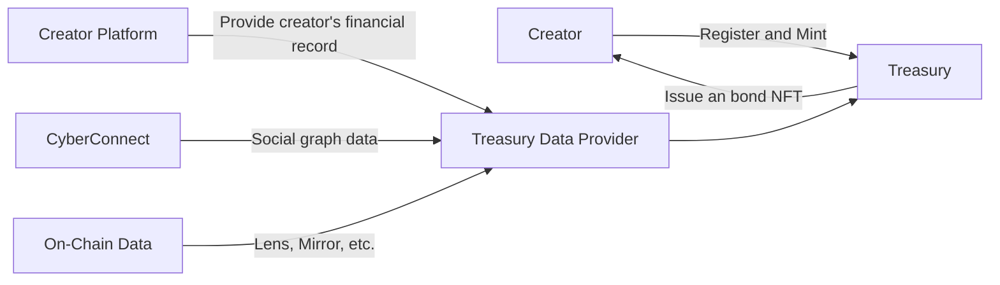
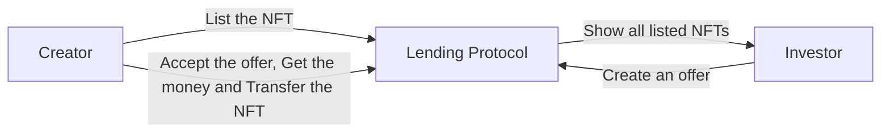
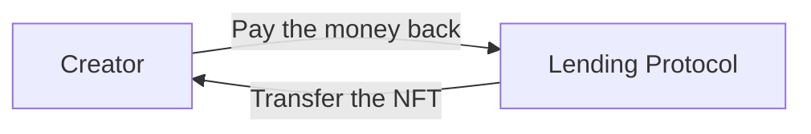
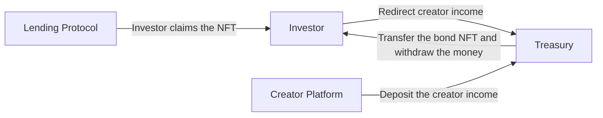

# 1TON Smart Contracts

This reposity contains the smart contracts of 1TON Treasury and 1TON Finance. The smart contracts are implemented in [FunC](https://ton.org/docs/develop/func/overview).

## User Flow

There are 4 main operations in 1TON:
1. Mint Bond
2. Borrow and Lend
3. Repay
4. Liquidate
  
### 1. Mint Bond

### 2. Borrow and Lend

### 3. Repay

### 4. Liquidate

## Layout
-   `contracts` - contains the source code of all the smart contracts of the project and their dependencies.
-   `wrappers` - contains the wrapper classes (implementing `Contract` from ton-core) for the contracts, including any [de]serialization primitives and compilation functions.
-   `tests` - tests for the contracts. Would typically use the wrappers.
-   `scripts` - contains scripts used by the project.   

## Contracts
1TON contract can be divided to three parts: 
- Bond  -  Represent real world assets. 
  - `bond.fc` - Implementation of immutable NTF Collection.
  - `bond-item.fc` - Implementation of immutable NTF item ,store creator information. 
- P2P NFT Lending Protocol - 
  - `lending.fc` - store loan information ,control life cycle of loan .
- Treasury - After liquidate, creator platform will redirect income of the creator to treasury pool 
  - `treasury_admin.fc` - Manage treasury pool 
  - `treasury_pool.fc` - Where real cash flow happens 

