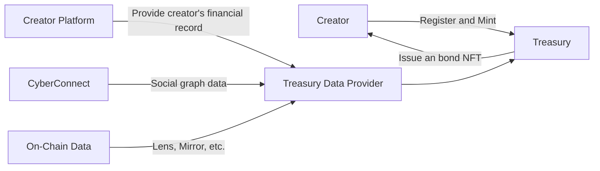
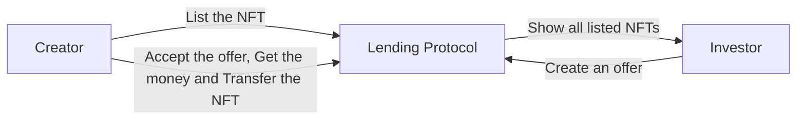
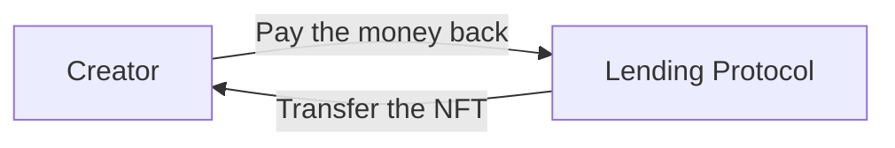
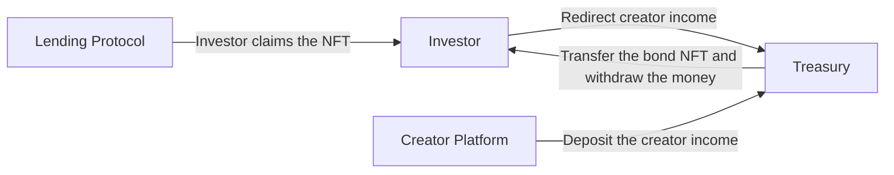

# 1TON Smart Contracts

This reposity contains the smart contracts of 1TON Treasury and 1TON Finance. The smart contracts are implemented in [FunC](https://ton.org/docs/develop/func/overview).

## User Flow

There are 4 main operations in 1TON:
1. Mint Bond
2. Borrow and Lend
3. Repay
4. Liquidate
  
### 1. Mint Bond

### 2. Borrow and Lend

### 3. Repay

### 4. Liquidate

## Structure

-   `contracts` contains the source code of all the smart contracts and their dependencies.
-   `wrappers` contains the wrapper classes, which are implemented from `Contract` of `ton-core`, for the contracts. including any [de]serialization primitives and compilation functions.
-   `tests` tests for the contracts. Would typically use the wrappers.
-   `scripts` contains the deployment and testing scripts.

## Smart Contracts

The 1TON smart contract can be divided to three parts: 

- Bond - Represents the real world assets. 
  - `bond.fc` - The implementation of immutable NTF collection.
  - `bond-item.fc` - The implementation of immutable NTF item, which stores the bond terms and the creator information. 
- Lending Protocol - A peer-to-peer NFT lending protocol.
  - `lending.fc` - Stores the loan terms.
- Treasury - The creator's income is redirected to the Treasury if the corresponding Bond NFT is active, which usually means that a lender liquidate the Bond NFT from an expired loan.
  - `treasury_admin.fc` - Manage treasury pool 
  - `treasury_pool.fc` - Where real cash flow happens 

